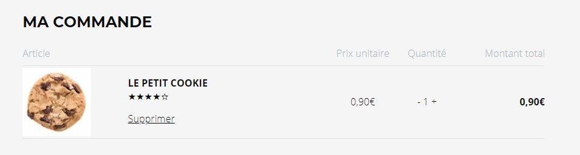

# Ajout d'informations dans le panier

Interface à implémenter : `CPointSoftware.Equihira.Extensibility.ECommerce.IInfoLignePanierProvider`

```csharp
namespace CPointSoftware.Equihira.Extensibility.ECommerce
{
    public interface IInfoLignePanierProvider
    {
        InfoLignePanier GetInfos(Guid ebc_guid, Guid elbGuid, ArticleQuantiteEtPrix article);
    }
}
```

Il n'y a qu'une méthode à implémenter : elle sera appelée à chaque fois qu'un nouvel article est ajouté au panier (attention, elle n'est pas appelé sur un changement de quantité). 

Vous pouvez retourner un objet contenant jusqu'à 4 informations personnalisées :

- 2 données textes, totalement personnalisées
- 2 données détaillants, sous la forme d'une chaine de caractères, des informations de frais annexes (par exemple la D3E)

Comme toute extension MEF, vous devrez ajouter un attribut `[Export]` sur la classe pour la rendre détectable en tant qu'extension.

## Déploiement

Une fois réalisée vous devrez déposer la dll avec cette classe dans votre dossier d'extensibilité, sous Ecommerce\Assemblies. Pour plus de renseignement sur les dossiers d'extensibilité, [consultez l'aide en ligne](https://www.altazion.dev/global/index.html#paths-importants).


## Exemple


