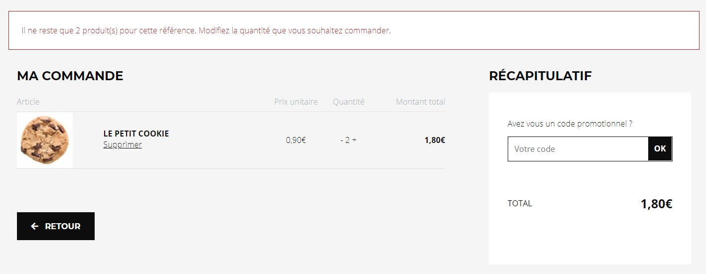

# Vérification du stock à la commande

Interface à implémenter : `CPointSoftware.Equihira.Extensibility.ECommerce.IPanierStockCheck`

```csharp
namespace CPointSoftware.Equihira.Extensibility.ECommerce
{
    public interface IPanierStockCheck
    {
        bool CheckStock(Guid art_guid, ref decimal quantite, Guid? magasin, string typeCommandable);
    }
}
```

Il n'y a qu'une méthode à implémenter : elle sera appelée à chaque changement de quantité dans le panier pour un produit. 

Vous devrez :

- vérifier la disponibilité de votre produit et renvoyer true si la quantité est disponible et peut être commandée
- renvoyer false ET mettre à jour la quantité avec le maximum commandable si tout n'est pas disponible.
- Si le `Guid` magasin est non `null`, le test de quantité doit être effectué dans le cadre de ce magasin (pour un achat emporté depuis le stock du magasin), si il est `null`, il s'agit d'un achat de type Web.

> TODO : vérifier si elle est appelée dans le cadre d'un produit immatériel

Comme toute extension MEF, vous devrez ajouter un attribut `[Export]` sur la classe pour la rendre détectable en tant qu'extension.

## Déploiement

Une fois réalisée vous devrez déposer la dll avec cette classe dans votre dossier d'extensibilité, sous Ecommerce\Assemblies. Pour plus de renseignement sur les dossiers d'extensibilité, [consultez l'aide en ligne](https://www.altazion.dev/global/index.html#paths-importants).


## Exemple



