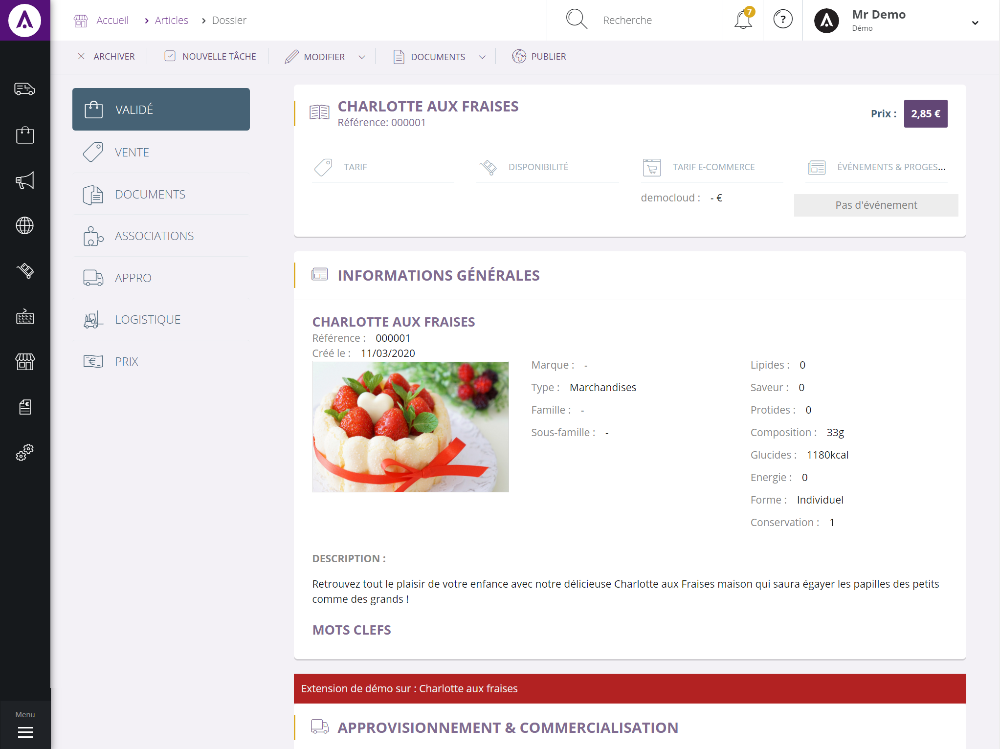

# Ajout d'informations dans le dossier article

Interface à implémenter : `CPointSoftware.Equihira.Extensibility.UI.IWebDossierArticlePart`

```csharp
namespace CPointSoftware.Equihira.Extensibility.UI
{
    public interface IWebDossierArticlePart
    {
        string Group { get; }

        Control GetControl(ArticleBase article);
    }
}
```

Comme toute extension MEF, vous devrez ajouter un attribut `[Export]` sur la classe pour la rendre détectable en tant qu'extension.

## Déploiement

Une fois réalisée vous devrez déposer la dll avec cette classe dans votre dossier d'extensibilité, sous Services\Assemblies. Pour plus de renseignement sur les dossiers d'extensibilité, [consultez l'aide en ligne](https://www.altazion.dev/global/index.html#paths-importants).

## Exemple


