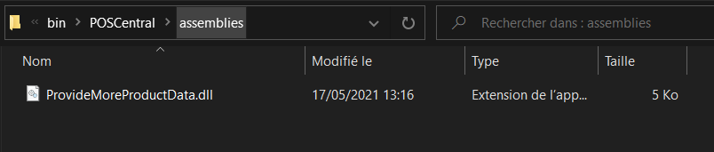

# Modification des informations produits

Interface à implémenter : `CPointSoftware.Equihira.Extensibility.IProvideMoreProductData`

```csharp
namespace CPointSoftware.Equihira.Extensibility
{
    public interface IProvideMoreProductData
    {
        void AddInfoToDetails(int rjs_id, int sit_pk, ArticlePhygitalDetail details);
        void AddInfoToList(int rjs_id, int sit_pk, ArticlePhygitalBase[] items);
    }
}
```

Les deux méthodes à implémenter permettent de modifier et/ou compléter les données renvoyées par les différents points API.

- `AddInfoToDetails` vous permet d'ajouter des informations sur les données détaillées (pour la fiche produit notamment)
- `AddInfoToList` permet de modifier les informations retournées dans les différentes listes.

Comme toute extension MEF, vous devrez ajouter un attribut `[Export]` sur la classe pour la rendre détectable en tant qu'extension.

## Déploiement

Une fois réalisée vous devrez déposer la dll avec cette classe dans votre dossier d'extensibilité, sous PosCentral\Assemblies. Pour plus de renseignement sur les dossiers d'extensibilité, [consultez l'aide en ligne](https://www.altazion.dev/global/index.html#paths-importants).


